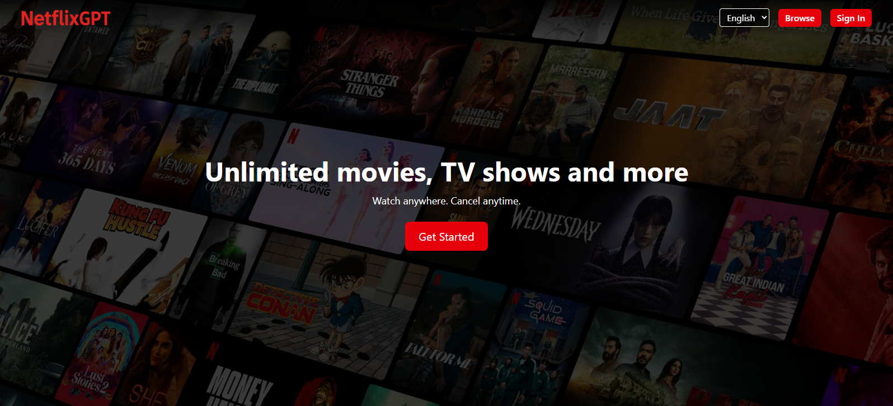
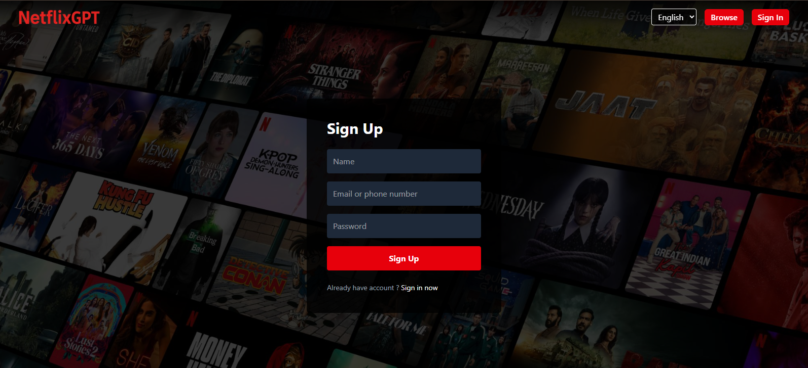
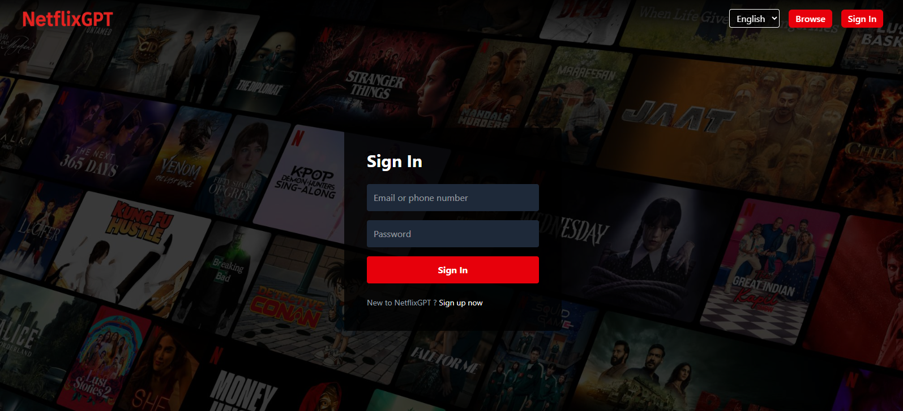
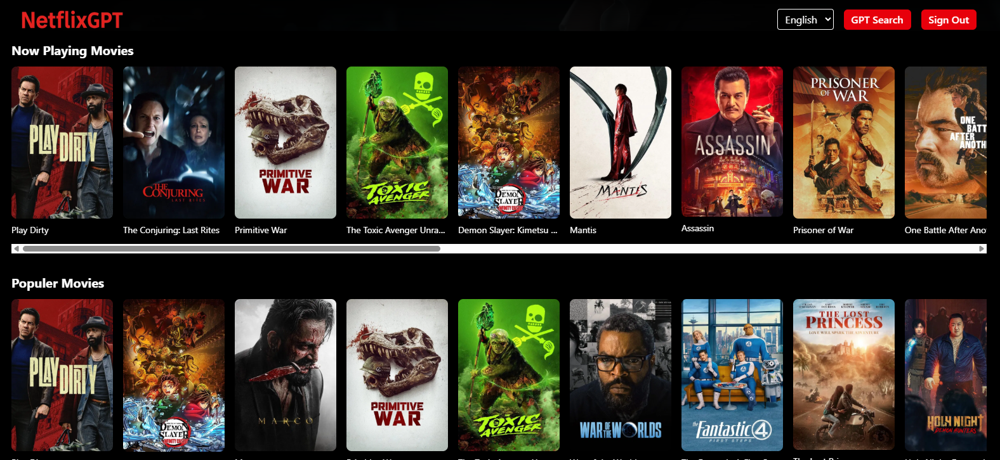
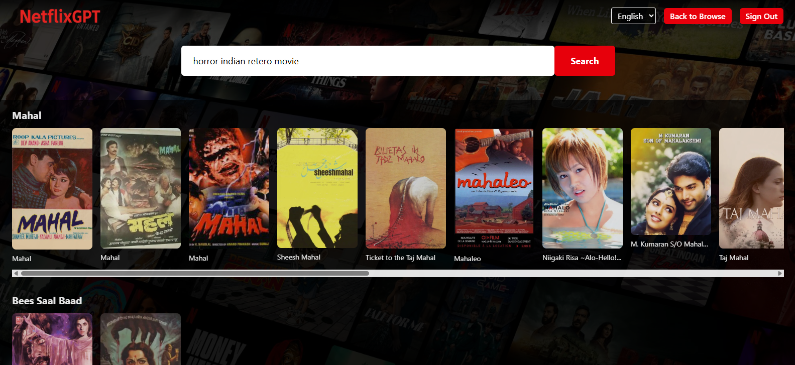

# 🎬 NetflixGPT – AI Powered Movie Recommendation App

**NetflixGPT** is a fully responsive movie streaming interface built with **React + Vite** that integrates **Firebase Authentication**, **TMDB API**, and **Gemini 2.5 Flash (Google Generative AI)** for smart movie search suggestions.  

It allows users to **sign up, log in**, explore movie categories (Now Playing, Popular, Top Rated, Upcoming), and get **AI-powered movie recommendations** — all in a sleek Netflix-style UI.

## Live demo - https://netflix-gpt-seven-ruddy.vercel.app/gpt

## 🚀 Features

### 🔐 Authentication
- Login and Signup using **Firebase Authentication**
- Persistent user sessions (using Context API)
- Secure protected routes

### 🏠 Browse Page
- Dynamic movie rows like Netflix (Now Playing, Popular, Top Rated, Upcoming)
- Movie data fetched via **TMDB API**
- Each movie card shows poster, title, and rating.
- Clicking a movie opens a **detailed page** with description, trailer, and related content
- Fully responsive layout for desktop and mobile

### 🌐 Multi-language Support
- Users can choose app language from dropdown  
- Supports multiple languages using Redux and a Language JSON object

### 🤖 GPT Movie Search (Gemini 2.5 Flash)
- Smart search powered by **Gemini 2.5 Flash**
- Type any genre or mood, and the AI suggests relevant movies
- Displays results as categorized movie lists fetched from TMDB
- Integrated with Redux for state management

### 💾 State Management
- Implemented using **Redux Toolkit**
- Stores language, movie lists, and GPT search results globally

### ⚙️ Tech Stack
- **Frontend:** React + Vite  
- **State Management:** Redux Toolkit  
- **Styling:** Tailwind CSS  
- **API:** TMDB API  
- **AI Integration:** Gemini 2.5 Flash  
- **Auth:** Firebase Authentication  
- **Deployment:** Vercel  


## 📸 Screenshots

1. Home page


2. Signup/Login page




3. MovieList/Browse page


4. MovieDetails page


5. AI search page


---

## 🧩 Folder Structure

``` 
netflixgpt/
├── src/
│ ├── components/
│ │ ├── Header.jsx
│ │ ├── MainContainer.jsx
│ │ ├── MovieList.jsx
│ │ └── GPTMovieSuggestion.jsx
│ ├── hooks/
│ │ ├── useNowPlayingMovies.js
│ │ ├── usePopularMovies.js
│ │ ├── useTopRatedMovies.js
│ │ └── useUpcomingMovies.js
│ ├── redux/
│ │ ├── store.js
│ │ ├── movieSlice.js
│ │ ├── gptSlice.js
│ │ └── languageSlice.js
│ ├── utils/
│ │ ├── constants.js
│ │ └── firebase.js
│ ├── pages/
│ │ ├── Login.jsx
│ │ ├── Browse.jsx
│ │ └── MovieDetails.jsx
│ ├── App.jsx
│ └── main.jsx
├── .env
├── package.json
└── vite.config.js
 ```

## ⚡ Setup Instructions

### 1️⃣ Clone the repository
git clone https://github.com/yourusername/netflixgpt.git
cd netflixgpt

### 2️⃣ Install dependencies
npm install

3️⃣ Create a .env file
VITE_OPENAI_API_KEY=your_gemini_api_key
VITE_TMDB_API_TOKEN=your_tmdb_api_key

4️⃣ Run the app locally
npm run dev

# 💡 Future Enhancements

- Add user profile and watchlist
- Integrate AI movie summaries
- Add dark/light mode toggle
- Implement caching for API calls


# 🧑‍💻 Author

YourBuddy is built with ❤️ by Ruchi Agrawal.
